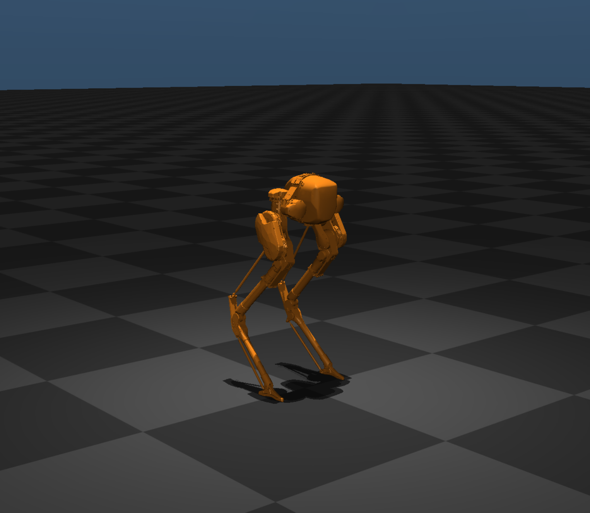

# Robot Learning Bipedal Footstep PID MPC

A comprehensive repository implementing advanced control strategies for bipedal robot locomotion using the Cassie robot in MuJoCo simulation. This project explores multiple control paradigms including reinforcement learning, model predictive control (MPC), and hybrid approaches for achieving stable and dynamic walking.

---



---

## 🚀 Project Overview

This repository demonstrates the integration of classical control theory and modern machine learning for bipedal robot walking. The project implements multiple control approaches using the Agility Robotics Cassie bipedal robot in MuJoCo simulation environment, focusing on:

- **Reinforcement Learning**: Deep RL policies for end-to-end walking control
- **Model Predictive Control**: Predictive footstep planning and trajectory optimization  
- **Hybrid MPC+RL**: Combining the strengths of both approaches
- **PID Control**: Low-level joint tracking and stability

## 📁 Repository Structure

This repository contains three main branches, each focusing on different aspects of bipedal locomotion control:

### 🎯 **Main Branch** (Current)
**Central Hub & Setup Instructions**

- **Comprehensive Setup Guide**: Complete installation for MuJoCo 2.1.0, TensorFlow 1.15, and OpenAI Baselines
- **Environment Configuration**: Ubuntu 22.04 setup with GPU support and troubleshooting
- **Documentation Hub**: Cross-branch references and integration examples
- **Platform Compatibility**: NVIDIA/Intel GPU support, headless rendering options

### 🦶 **Footstep Following Branch** 
**Focus: Pure Reinforcement Learning for Cassie Walking**

- **Deep RL Implementation**: PPO-based policy learning with continuous action spaces
- **Cassie Robot Simulation**: High-fidelity MuJoCo simulation with spring-driven passive joints
- **Parallel Training**: Multi-core CPU training using OpenAI Baselines
- **Performance**: 1.0 m/s walking speed, 33 Hz control, robust walking policies
- **Team Collaboration**: Joint work with Sounderya Varagur Venugopal

### 🤖 **MPC + RL Branch**
**Focus: Advanced Hybrid Control Architecture**

- **Model Predictive Control**: Finite horizon optimization with real-time constraint satisfaction
- **RL Integration**: Adaptive parameter tuning and strategic decision making
- **Hybrid Architecture**: Hierarchical control with intelligent mode switching
- **Advanced Features**: Uncertainty quantification, multi-objective optimization
- **Research-Grade**: State-of-the-art techniques for safety-critical applications

## 🛠️ System Requirements

- **OS**: Ubuntu 22.04 LTS
- **Hardware**: NVIDIA/Intel GPU (or software rendering)
- **Memory**: 8GB RAM minimum (16GB recommended)
- **Storage**: 5GB free space
- **Dependencies**: MuJoCo 2.1.0, Python 3.7.16, TensorFlow 1.15

## ⚙️ Quick Start Installation

### 1. Create Conda Environment
```bash
conda create -n cassie python=3.7.16 -y
conda activate cassie
```

### 2. Install Core Dependencies
```bash
pip install tensorflow==1.15
pip install gym
pip install mujoco-py==2.1.2.14

# Install OpenAI Baselines
git clone https://github.com/openai/baselines.git
cd baselines
pip install -e .
cd ..
```

### 3. Install MuJoCo 2.1.0
```bash
# Download from https://mujoco.org/download
mkdir -p ~/.mujoco
tar -xzf mujoco210-linux-x86_64.tar.gz -C ~/.mujoco/
mv ~/.mujoco/mujoco210-linux-x86_64 ~/.mujoco/mujoco210
```

### 4. Configure Environment Variables
Add to `~/.bashrc`:
```bash
export MUJOCO_PY_MUJOCO_PATH=$HOME/.mujoco/mujoco210
export LD_LIBRARY_PATH=$LD_LIBRARY_PATH:$HOME/.mujoco/mujoco210/bin
export MUJOCO_GL=egl  # For headless rendering
```

### 5. Install System Dependencies
```bash
sudo apt update
sudo apt install libgl1-mesa-glx libgl1-mesa-dri libglfw3 libosmesa6 libglew-dev mesa-utils
```

### 6. Fix Compatibility Issues
```bash
# Temporary fix for GLIBCXX compatibility
export LD_PRELOAD=/usr/lib/x86_64-linux-gnu/libstdc++.so.6

# For permanent fix, add to Conda environment activation script
mkdir -p ~/miniconda3/envs/cassie/etc/conda/activate.d
echo '#!/bin/bash' > ~/miniconda3/envs/cassie/etc/conda/activate.d/env_vars.sh
echo 'export LD_PRELOAD=/usr/lib/x86_64-linux-gnu/libstdc++.so.6' >> ~/miniconda3/envs/cassie/etc/conda/activate.d/env_vars.sh
chmod +x ~/miniconda3/envs/cassie/etc/conda/activate.d/env_vars.sh
```

## 🚀 Running the Programs

### Branch-Specific Quick Start

#### For Reinforcement Learning (footstep_following):
```bash
git checkout footstep_following
cd cassieWalking/exe
./train.sh  # Start training
./test.sh   # Test trained policy
```

#### For MPC+RL Hybrid Control:
```bash
git checkout MPC+RL
cd cassie_rl_walking/exe
./test_static.sh  # Static testing
./play.sh         # Interactive simulation
```

If you encounter GLEW initialization errors:
```bash
export LD_PRELOAD=/usr/lib/x86_64-linux-gnu/libstdc++.so.6
./play.sh
```

## 📊 Performance Comparison

| Branch | Control Method | Complexity | Real-time | Adaptability | Sim-to-Real |
|--------|---------------|------------|-----------|--------------|-------------|
| **Footstep Following** | Pure RL | Medium | Excellent | High | Good |
| **MPC+RL** | Hybrid | High | Good | Very High | Excellent |

### Key Performance Metrics:
- **Footstep Following**: 1.0 m/s walking, 33 Hz control, stable RL policies
- **MPC+RL**: Predictive planning + adaptive learning, robust to uncertainties

## 🎯 Branch-Specific Documentation

### **[📖 Footstep Following Branch](../../tree/footstep_following)**
- **Algorithm**: PPO-based policy learning for direct neural control
- **Use Case**: Research baseline, rapid prototyping, end-to-end learning
- **Highlights**: Parallel training, robust walking policies, performance visualization

### **[📖 MPC+RL Branch](../../tree/MPC+RL)**
- **Algorithm**: Combined MPC optimization with RL adaptation
- **Use Case**: Safety-critical applications, uncertain environments
- **Highlights**: Predictive planning, constraint satisfaction, adaptive parameters

Each branch includes:
- 📋 Detailed technical documentation and mathematical formulations
- 🛠️ Step-by-step implementation guides and usage examples
- 📈 Performance benchmarks and analysis tools
- 🐛 Troubleshooting guides and common solutions

## 🔬 Applications & Use Cases

### **Research Applications**
- Comparative analysis of RL vs MPC vs Hybrid approaches
- Sim-to-real transfer studies for bipedal locomotion
- Benchmark for novel bipedal control algorithms

### **Educational Use**
- Graduate-level robotics coursework
- Control theory and machine learning integration
- Open-source learning platform for bipedal robotics

### **Industry Applications**
- Humanoid robot locomotion development
- Legged robot control system prototyping
- Algorithm validation and verification

## 🤝 Contributing

We welcome contributions for:
- 🐛 Bug fixes and installation improvements
- ⚡ Performance optimizations and new features
- 📚 Documentation and tutorial enhancements
- 🧪 Testing and validation tools

## 📄 Citation

```bibtex
@misc{ansari2024bipedal,
  title={Robot Learning Bipedal Footstep PID MPC: A Comprehensive Control Framework},
  author={Kashif Ansari and Sounderya Varagur Venugopal},
  year={2024},
  publisher={GitHub},
  url={https://github.com/kashifansaricodes/Robot-Learning-Bipedal-Footstep-PID-MPC}
}
```

## 🔗 Related Resources

### **Essential Papers**
- [Reinforcement Learning for Versatile, Dynamic, and Robust Bipedal Locomotion Control](https://arxiv.org/abs/2401.16889)
- [Learning Locomotion Skills for Cassie: Iterative Design and Sim-to-Real](https://arxiv.org/abs/1909.05944)
- [Feedback Control For Cassie With Deep Reinforcement Learning](https://arxiv.org/abs/1803.05580)

### **Related Repositories**
- [HybridRobotics Cassie RL Walking](https://github.com/HybridRobotics/cassie_rl_walking)
- [Bipedal Robot Papers Collection](https://github.com/tayalmanan28/Bipedal-Robot-Papers)
- [Awesome Legged Locomotion Learning](https://github.com/gaiyi7788/awesome-legged-locomotion-learning)

### **Documentation**
- [MuJoCo Documentation](https://mujoco.readthedocs.io/)
- [OpenAI Baselines Documentation](https://stable-baselines.readthedocs.io/)
- [Cassie Robot Specifications](https://www.agilityrobotics.com/cassie)

---

**🚀 Ready to explore bipedal robotics? Choose your branch and dive into the fascinating world of legged locomotion control!** 🤖👣

## ✅ Final Notes

- Ensure `~/.mujoco/mujoco210/bin/` contains all required `.so` files
- `MUJOCO_GL=egl` is suitable for headless or offscreen rendering
- This setup supports both GUI and non-GUI execution of MuJoCo-based RL environments

**📖 Start with the [Footstep Following Branch](../../tree/footstep_following) for RL-based walking or the [MPC+RL Branch](../../tree/MPC+RL) for advanced hybrid control!**
